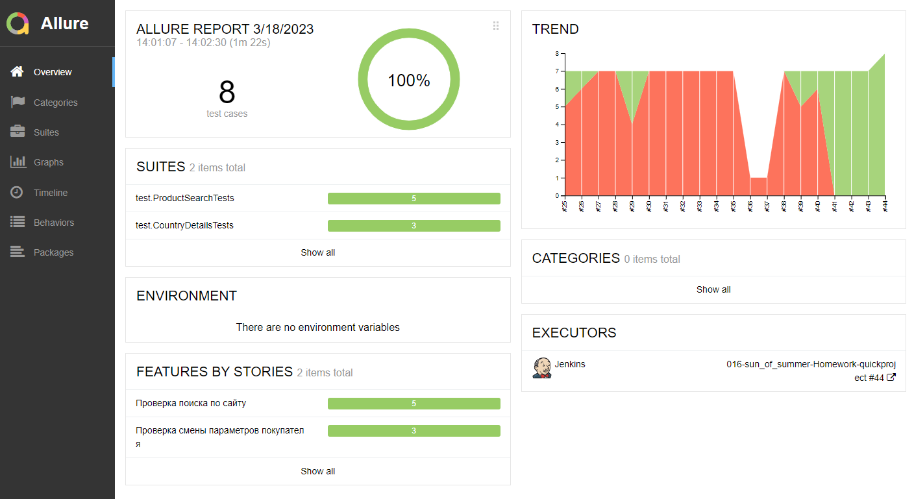
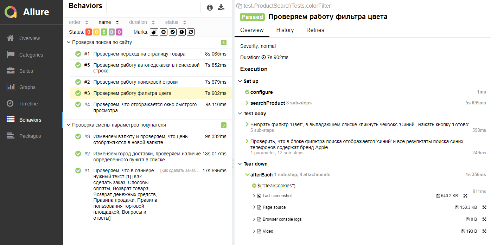
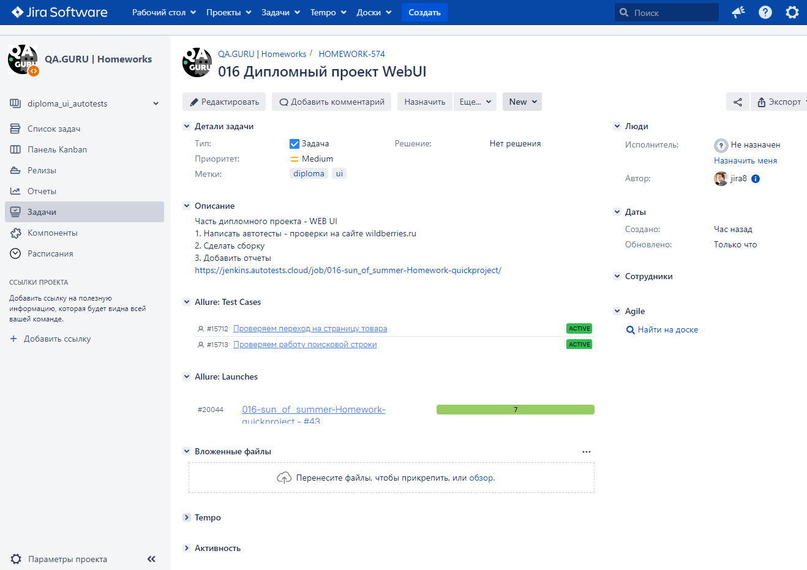

## Небольшой автотест для проверки инструментов поиска на сайте [wildberries.ru](https://www.wildberries.ru/)
### Технологический стек
________
                                    

-----
* Написан на ``Java`` с использованием фреймворка ``Selenide``
* Применяется фреймворк для модульного тестирования ``JUnit 5`` 
* ``Gradle`` используется для автоматизированной сборки проекта
* Удаленно тест запускается с помощью сервера``Jenkins``
* ``Selenoid`` запускает браузеры в контейнерах ``Docker``
* Система ``Allure Report`` формирует отчет о запуске тестов
* Интеграция с ``Jira`` и ``Allure TestOps``
* ``Telegram``-бот отправляет уведомление о результатах прохождения тестов

###  Содержание тестов:
Проверка работы инструментов поиска по сайту при
1. введении запроса в поисковую строку
2. клике на автоподсказку
3. установке определенного параметра в фильтре результатов
4. переходе на страницу товара и окно быстрого просмотра
5. смене валюты для отображения цен
6. смене пункта выдачи товара

###  Параметризованная сборка в [Jenkins](https://jenkins.autotests.cloud/job/016-sun_of_summer-Homework-quickproject/build?delay=0sec) 

  

###  Чтобы увидеть отчёт о прохождении тестов в Allure Report, нужно кликнуть на иконку **"Allure Report"**  

   

   

###  Интеграция с [Allure TestOps](https://allure.autotests.cloud/project/1970/dashboards)

 

 

###  Интеграция с Jira

 

###  Видео прохождения тестов в Selenoid  

###  Уведомления о прохождении тестов в Telegram  

  
